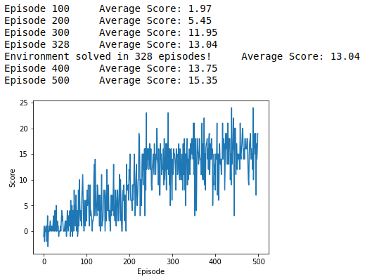

# Report

## The result

The agent was able to solve the environment in 328 episodes, with an average reward of 13.04. The average reward after all 500 traing-episodes is 15.35.

## The algotithm

For this project I used the standard Deep-Q-Learning-algotithm. I operate with a four layer feed-forward neural network with 37 input nodes, 64 in the two hidden layers and 4 output nodes which represent the for actions the agent can take. The input layer is designed to obtain an input vector with 37 dimensions.
